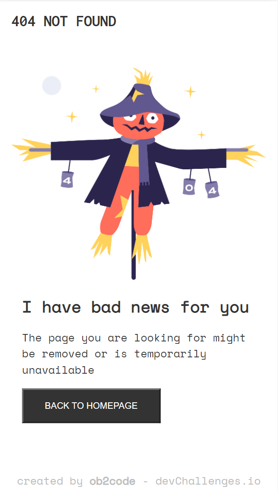

<!-- Please update value in the {}  -->

<h1 align="center">404 Not Found</h1>

<div align="center">
   Solution for a challenge from  <a href="http://devchallenges.io" target="_blank">Devchallenges.io</a>.
</div>

<div align="center">
  <h3>
    <a href="https://ob2code.github.io/404-not-found/">
      Demo
    </a>
    <span> | </span>
    <a href="https://github.com/ob2code/404-not-found.git">
      Solution
    </a>
    <span> | </span>
    <a href="https://devchallenges.io/challenges/wBunSb7FPrIepJZAg0sY">
      Challenge
    </a>
  </h3>
</div>

<!-- TABLE OF CONTENTS -->

## Table of Contents

- [Overview](#overview)
  - [Built With](#built-with)
- [Features](#features)
- [Contact](#contact)
- [Acknowledgements](#acknowledgements)

<!-- OVERVIEW -->

## Overview



Hello!

- I am a bit confused when dealing header text with large screen. The problem has solved until add one more specific screen query.
```css
/* X-Large devices (large desktops, 1200px and up) */
  @media screen and (min-width: 1200px) {
    .card__header {
      width: 60%;
    }
  }
```
- Learned how to center bottom an element
```css
.attribution {
  position: absolute;
  margin-left: auto;
  margin-right: auto;
  left: 0;
  right: 0;
  text-align: center;
}
```

### Built With

<!-- This section should list any major frameworks that you built your project using. Here are a few examples.-->

- Clean HTML & CSS

## Features

<!-- List the features of your application or follow the template. Don't share the figma file here :) -->

This application/site was created as a submission to a [DevChallenges](https://devchallenges.io/challenges) challenge. The [challenge](https://devchallenges.io/challenges/wBunSb7FPrIepJZAg0sY) was to build an application to complete the given user stories.


## Acknowledgements

<!-- This section should list any articles or add-ons/plugins that helps you to complete the project. This is optional but it will help you in the future. For exmpale -->

- Do recommend [Steps to replicate a design with only HTML and CSS](https://devchallenges-blogs.web.app/how-to-replicate-design/)
- StackOverflow - Align an element center in bottom screen (see sample code above).

## Contact

- 💻Website (under construction) [ob2code.netlify.app](https://ob2code.netlify.app/)
- 👨‍💻GitHub [@ob2code](https://github.com/ob2code)
- 🐤Twitter [@ob2code](https://twitter.com/ob2code)
